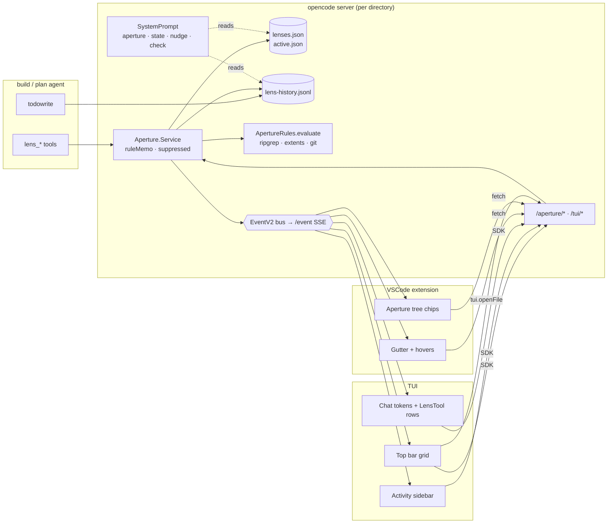
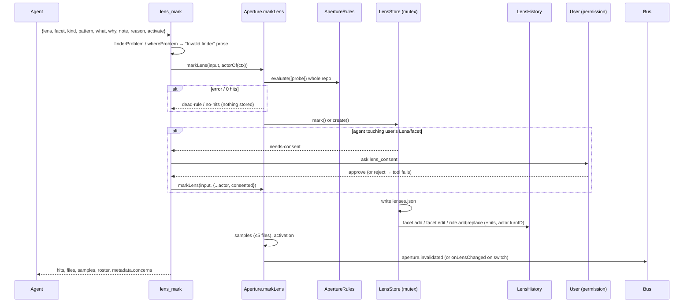
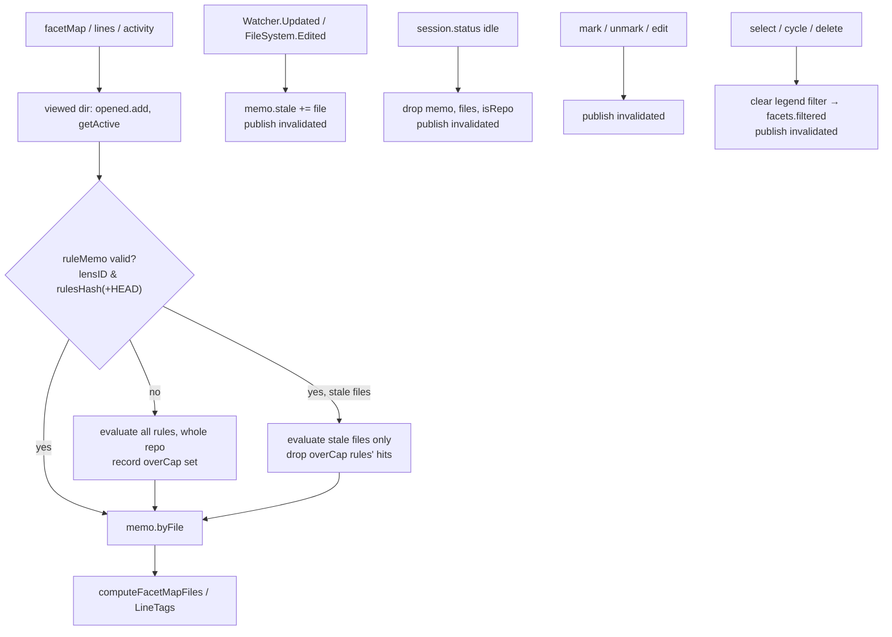
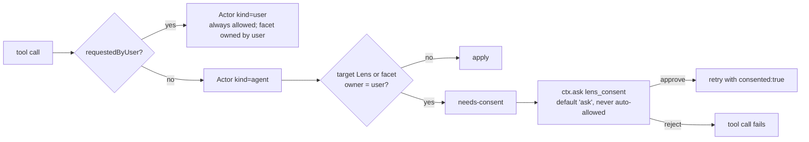
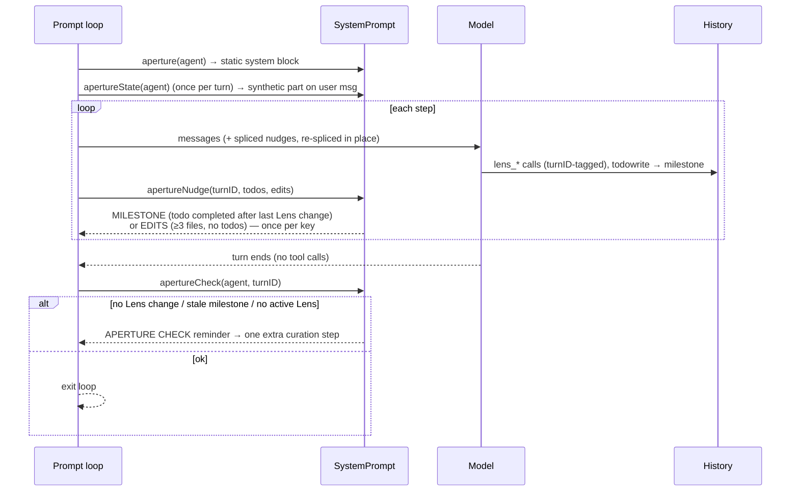
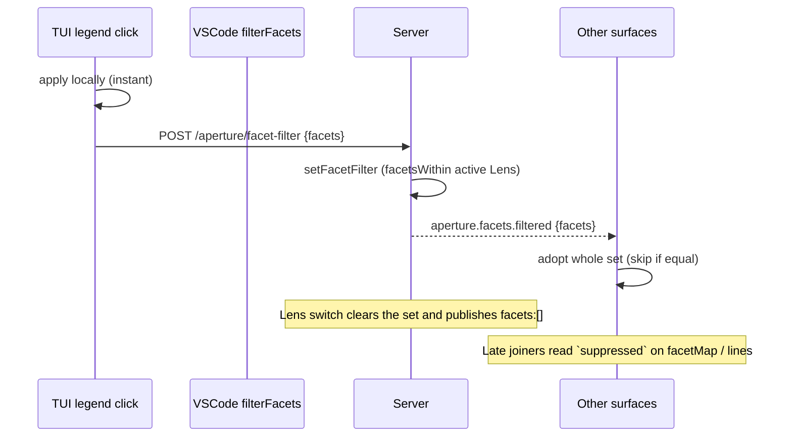
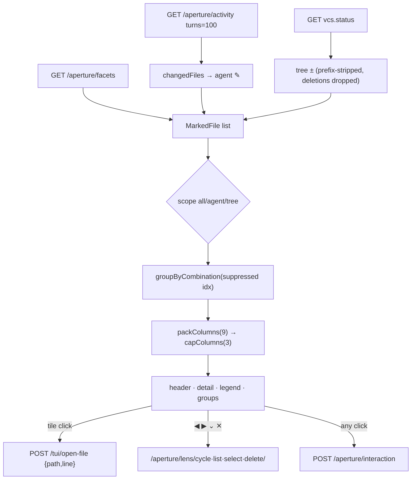
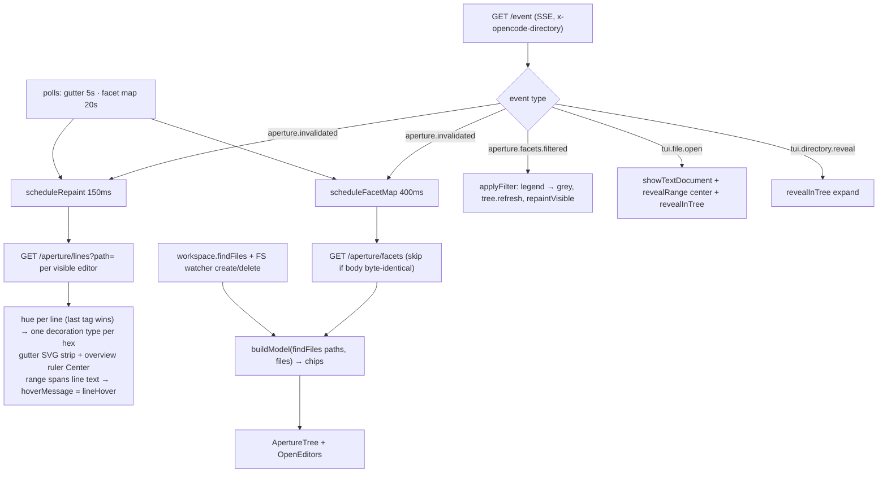

# Aperture — Architecture Overview (v3 / v3.1)

This document describes the Aperture code on the `v3changes` branch: what each entity is, what
data it holds, what API it exposes, and how data moves between the server, the agent, the TUI
and the VSCode extension.

For product intent and milestone status, see `PLAN.md`. This file only covers the code.

---

## 0. The idea in one paragraph

A **Lens** is a named set of up to six **facets** (concerns). Each facet is owned by one or more
**rules**: deterministic queries (a ripgrep regex, a top-level declaration name, or a git diff,
optionally narrowed by git history). Only the queries are stored. The **marked lines** are
re-derived from disk on every read, so marks follow the code as it changes. The build/plan agent
curates its own Lens while it works, and the user can always see *why* a line is marked: every
hover shows the facet's **what** (what the marked lines are), its **why** (why they matter for
the task now), and the **query** and **note** of the rule that marked the line. Every facet has an
**exact hex colour** that is identical on every surface: the TUI top bar, the TUI sidebar, chat
prose, the VSCode gutter and the VSCode tree.

---

## 1. Source map

| Area | Path | Role |
| --- | --- | --- |
| **Domain model** | `packages/opencode/src/aperture/lenses.ts` | Pure types (`Lens`, `Facet`, `Rule`, `Finder`, `GitFilter`), palettes, colour assignment, validators, legend and roster helpers. No dependencies, so the TUI can import it. |
| Persistence | `aperture/lens-store.ts` | `.opencode/aperture/lenses.json` + `active.json`. Read-time migration, a per-directory mutex, ownership/consent checks, and every mutation. |
| History | `aperture/lens-history.ts` | Append-only `.opencode/aperture/lens-history.jsonl`, plus the `Actor` type. |
| Rule evaluation | `aperture/rules.ts`, `aperture/git-lookup.ts`, `aperture/extents.ts` | Finder → filter → clamp/merge → `RuleHit`s, caps and diagnostics. Git diff/blame parsing. Top-level declaration extents and hunk parsing. |
| **Service** | `aperture/aperture.ts` | `Aperture.Service` (Effect). Lens ops, the memoised rule hits, invalidation, and the three reads (`facetMap`, `lines`, `activity`). |
| Wire shapes / events | `aperture/payload.ts`, `aperture/event.ts`, `cli/cmd/tui/event.ts` | `LegendEntry`, `LensInfo`, `LineTag`, `Lines`. Events: `aperture.invalidated`, `aperture.facets.filtered`, `tui.file.open`, `tui.directory.reveal`. |
| Activity | `aperture/activity.ts`, `activity-model.ts`, `activity-steps.ts` | Per-turn agent activity derived from the message store, and segmented into steps for the sidebar. |
| Pure view helpers | `aperture/facet-grid.ts`, `treemap.ts`, `color-256.ts`, `files.ts` | Combination-grid grouping and packing, band cell allocation, xterm-256 maths, the repo file set. |
| Study logging | `aperture/study-log.ts` | Per-session research timeline (`perf/logs/sessions/...`). |
| HTTP | `server/routes/instance/httpapi/groups/aperture.ts`, `handlers/aperture.ts`, `groups/tui.ts`, `handlers/tui.ts` | `/aperture/*` routes, plus `/tui/open-file` and `/tui/reveal-directory`. |
| Agent tools | `tool/lens-*.ts`, `tool/lens-consent.ts`, `tool/registry.ts`, `tool/todo.ts` | `lens_list`, `lens_select`, `lens_edit`, `lens_facet_files`, `lens_mark`, `lens_unmark`. The consent helper. Milestones written from `todowrite`. |
| Prompting | `session/system.ts`, `session/prompt.ts`, `agent/prompt/explore.txt` | Static `<aperture>` block, per-turn `<aperture-state>`, mid-turn nudges, the end-of-turn check, and Explore's PROPOSED MARKS section. |
| TUI | `cli/cmd/tui/feature-plugins/system/aperture*.ts(x)`, `feature-plugins/sidebar/activity.tsx`, `routes/session/index.tsx`, `component/prompt/index.tsx`, `app.tsx` | Top bar, Lens picker, colour resolver, chat facet tokens, `LensTool` rows, Activity Path sidebar, `/lens-delete`, `/lens-switch`. |
| VSCode | `sdks/aperture-vscode/src/*.ts` | Gutter strips with hovers, the Aperture tree with facet chips, Open Editors, the SSE client, file ops. |
| Debug | `cli/cmd/debug/aperture-colors.ts` | `opencode debug aperture-colors`: checks that palette colours survive the terminal. |

---

## 2. Entities and data structures

### 2.1 Domain model — `aperture/lenses.ts`

This file is pure and has no dependencies. Both the server and the TUI bundle import it.

```ts
type Owner = "user" | "agent"

interface Facet {
  id: string            // kebab slug, unique within the Lens
  label: string         // legend text
  what: string          // WHAT the marked lines are — the facet's identity: corrected, never repurposed
  why: string           // WHY to look at them for the task now — task-relative, rewritten as the task moves
  color: string         // exact "#RRGGBB" from the palette, pinned at mint time
  owner: Owner
  createdBy?: string    // agent name, when an agent minted it
}

type Finder =
  | { kind: "pattern"; pattern: string; glob?: string[]; caseSensitive?: boolean } // ripgrep regex → matched lines
  | { kind: "symbol"; name: string; path?: string }                                // top-level decl → its whole extent
  | { kind: "structural"; pattern: string; language: string; glob?: string[] }     // ast-grep (stored, reported unsupported)
  | { kind: "diff"; ref?: string; glob?: string[] }                                // lines changed vs ref (default HEAD)

interface GitFilter { changed?: string; author?: string; since?: string } // narrows hits at LINE level

interface Rule {
  id: string        // `${facetSlug}-${sha256(find+where)[0..8]}`, so re-marking the same query replaces in place
  facet: string     // a facet id on THIS Lens
  find: Finder
  where?: GitFilter
  note?: string     // which part of the concern this rule marks; required on an agent's 2nd+ rule
  createdBy?: string
}

interface Lens {
  id: string        // `${slug(name)}-${hash8}`
  name: string
  description: string
  palette: "categorical" | "ordinal"
  facets: Facet[]   // ≤ MAX_FACETS (6)
  owner: Owner
  rules?: Rule[]    // ≤ MAX_RULES (32)
}
```

**Constants**

| Constant | Value | Meaning |
| --- | --- | --- |
| `MAX_FACETS` | 6 | One facet per palette colour. |
| `MAX_RULES` | 32 | Rules per Lens. |
| `MAX_RULE_HITS` | 500 | Above this a rule is stored but **not painted** (reported as over the cap). |
| `MAX_DIFF_HITS` | 5000 | A higher cap for `diff` rules, since a feature branch is meant to be broad. |
| `NONE_HUE` / `UNTAGGED_HUE` | `#8A8A8A` / `#444444` | "Other" grey (also used for suppressed facets) / "Non-code" grey. |

**Palettes.** `CATEGORICAL` has six exact xterm-256 colours: crimson `#D7005F`, amber `#AF5F00`,
chartreuse `#AFAF00`, emerald `#00875F`, cyan `#00AFD7` and indigo `#5F5FD7`. `ordinal` is the same
six in reverse order. `COLOR_NAMES` maps each hex to a word.

**Helpers**

| Function | Purpose |
| --- | --- |
| `assignColors(palette, facets)` | Keeps each facet's stored colour if it is valid and not already taken. Other facets get the lowest free slot. A removal therefore never changes the colours of the remaining facets. |
| `repaletteColors(from, to, facets)` | On a palette switch, keeps each facet's slot index. |
| `finderProblem(v)` / `whereProblem(v)` / `isValidFinder(v)` | Total shape validators. They return prose that tells the agent how to fix the input. |
| `isGitRule(rule)` | True for a `diff` finder or any `where` filter. The memo key then includes HEAD. |
| `describeFinder(find, where)` | The single readable form of a query, e.g. `pattern /x/ glob a/** changed in HEAD`. Used in hovers, `lens_list` and history. |
| `legend(lens)` → `LegendEntry[]` | `{facet,label,color,what,why,queries[]}`. Drives every surface. |
| `concernRoster(lens)` → `ConcernSummary[]` | Adds `colorName`, `owner` and rule count. This is what agents see. |
| `findFacet(lens, ref)` | Matches by id, or by label case-insensitively. |
| `facetsWithin(lens, ids)` | Guards the legend filter so it only contains facets the current Lens has. |
| `slugify(name)` | Lowercase kebab, at most 40 characters. |

### 2.2 Persistence — `aperture/lens-store.ts`

**Files** (under `<project>/.opencode/aperture/`, committable):

- `lenses.json`: `Record<lensID, Lens>`. Key order is creation order.
- `active.json`: `{ id }`.
- `lens-history.jsonl`: see §2.3.

**Concurrency.** There is one `Semaphore(1)` per directory (`withDoc`). Every mutation is a
read-modify-write inside it, and the history append happens inside the same permit. History
order and definition order therefore always agree.

**Read-time migration (`migrate`).** This step never throws. It:

- maps legacy palettes (`pastel`, `bright-ordinal`, …) to `categorical` or `ordinal`;
- drops v2 painter-owned facets that no rule refers to (it keeps `ruleOnly`, facets with an owner, and facets with rules);
- defaults a missing owner to `"user"`;
- ignores the retired facet `description` field (it disappears from disk on the next write);
- drops rules with an invalid shape;
- truncates to the caps;
- drops v2 Overview Lenses that are left empty and had a `prompt`.

**Reads:** `list(dir)`, `get(dir,id)`, `resolve(all, idOrName)`, `getActiveId(dir)`, `getActive(dir)`.
`getActive` falls back to the first Lens when the stored id is gone.

**Mutations.** Each takes an `Actor` (§2.3). Each returns a discriminated result and appends history when the write succeeds.

| Function | Effect | Result statuses |
| --- | --- | --- |
| `create(dir, CreateInput, actor)` | Creates a Lens, its first facet and its first rule in one write. | `ok` · `needs-what-why` |
| `mark(dir, id, MarkInput, actor)` | Adds or replaces a rule, minting the facet if it is new. A `why` (or a corrected `what`) on an existing facet is recorded as a `facet.edit` with `fields`. | `ok` · `not-found` · `needs-consent` · `facet-cap` · `rule-cap` · `needs-what-why` · `needs-note` · `needs-justification` |
| `unmark(dir, id, {rule? \| facet?}, actor)` | Removes one rule, or a facet together with all its rules. | `ok` · `not-found` · `needs-consent` · `unknown-rule` · `unknown-facet` |
| `update(dir, id, UpdateInput, actor)` | Changes the Lens name, description or palette, and facet label, what or why. Never changes rules. | `ok` · `not-found` · `needs-consent` · `unknown-facet` · `needs-justification` |
| `remove(dir, id, actor)` | Deletes the Lens. | `ok` · `not-found` · `needs-consent` |
| `setActive(dir, lens, actor)` | Writes `active.json` and records `lens.select`. | — |
| `milestone(dir, todos[], actor)` | Writes a `milestone` entry per completed todo, with `after.view` set to the full active Lens. | — |

Every `ok` result carries `written: boolean`. A failed disk write is reported as `false` and is
never claimed as success.

**Ownership rules (`consentNeeded`).** Consent is needed when the actor is an agent
(`kind: "agent"`), has not consented, and the Lens or the target facet is owned by the user.
The agent-only content rules (TUI users are never asked):

- `whatWhyMissing`: minting a facet needs both `what` and `why` → `needs-what-why` with the `missing` fields.
- `needs-note`: a new (not replacing) rule on a facet that already has one needs a `note`.
- `unjustified`: correcting a facet's `what` or `label` (its identity) needs `actor.reason` →
  `needs-justification`. Rewriting a `why` never does. A change of intent should be a new facet.

### 2.3 History — `aperture/lens-history.ts`

```ts
interface Actor {
  kind: Owner           // "user" also when an agent acts with requestedByUser:true
  agent?: string
  sessionID?: string
  turnID?: string       // id of the user message that opened the chat turn (assistant.parentID)
  messageID?: string
  callID?: string
  reason?: string       // why this call was made
  consented?: boolean
}
const USER: Actor = { kind: "user" }   // every HTTP mutation

type Op = "lens.create" | "lens.delete" | "lens.edit" | "lens.select"
        | "facet.add" | "facet.remove" | "facet.edit"
        | "rule.add" | "rule.replace" | "rule.remove"
        | "milestone"

interface Entry {
  seq: number; at: number; op: Op; actor: Actor
  lens: { id; name }; facet?: string; rule?: string
  before?: Snapshot; after?: Snapshot
  hits?: { lines; files; overCap? }          // at rule creation
  milestone?: { todo: string; index: number }
  fields?: ("label" | "what" | "why")[]      // facet.edit only: which fields changed
}
type Snapshot = { lens: {name,description,owner} } | { view: Lens } | { facet: Facet; rules?: Rule[] } | { rule: Rule }
interface Query { since?; sessionID?; turnID?; lens?; limit? }
```

API: `append(dir, drafts)` and `read(dir, query)`. `append` is best-effort and swallows errors.
`seq` comes from an in-memory counter that is seeded from the file's line count. `read` parses
each line independently and drops corrupt lines. `resetForTest(dir)` resets the counter.

### 2.4 Rule evaluation — `aperture/rules.ts`, `git-lookup.ts`, `extents.ts`

```ts
interface RuleHit { rule; facet; note?; ranges: [start,end][] /* 1-based, clamped, merged */; lines; bytes }
interface RuleDiagnostic { rule; hits; files; overCap?: true; error?: string }
interface RuleResult { byFile: Map<relPath, RuleHit[]>; diagnostics: RuleDiagnostic[] }
interface GitLookup {
  changes(ref): Effect<Map<path, [s,e][] | "all">>   // one `git diff --unified=0 --relative` (+ untracked for working-tree refs)
  blame(file, since?): Effect<BlameLine[] | undefined> // `git blame --porcelain` per file
}
```

- `evaluate(dir, rules, files?, git?)` never fails. A rule that throws is turned into
  `diagnostic.error`. If `files` is given, only those files are re-evaluated (the incremental path).
- Each rule runs **find → applyWhere → clampAll/measure**:
  - `pattern`: uses `Ripgrep`. The cap is counted across files, because ripgrep's `--max-count` is per file. Case-insensitive matching uses an inline `(?i)`.
  - `symbol`: `extentsOf(content)` finds column-0 declarations with a regex. The mark covers the whole extent.
  - `diff`: uses `GitLookup.changes(ref)`.
  - `structural`: always returns an error (the ast-grep backend, S1b, is not installed).
  - `where`: `changed` is intersected with diff hunks first, then `author`/`since` are applied through blame. Blame is limited to `MAX_BLAME_FILES = 200` files. Filtered rules may match up to `MAX_PREFILTER_LINES = 20 000` lines before filtering.
- If a rule is over its cap, its hits are dropped here, so `byFile` never contains paint from an over-cap rule.
- `rulesHash(rules)` is an order-insensitive hash of `{id,facet,find,where}` and is used as the memo key.
- `extents.ts` also exports `parseHunkRanges(patch)` (used by `git-lookup.ts`) and `clampRanges(...)` (used by `rules.ts`).

### 2.5 The service — `aperture/aperture.ts`

`Aperture.Service` (`@opencode/Aperture`). The default layer provides `EventV2`, `Database` and `Git`
itself. It is shared, through the common memoMap, between the HTTP server and the tool registry,
so tools and the view mutate the same instance.

```ts
interface Interface {
  lenses(): Lens[]
  activeLens(): Lens | undefined
  selectLens(idOrName, actor): SelectOutcome            // ok | not-found | needs-consent
  cycleLens("next"|"prev", actor): LensInfo | undefined
  editLens(UpdateInput & {lens}, actor): UpdateResult
  markLens(MarkLensInput, actor): MarkOutcome
  unmarkLens({lens, rule?, facet?}, actor): UnmarkResult
  deleteLens(idOrName, actor): DeleteOutcome            // ok{active?} | not-found | needs-consent
  facetFiles(lens?, facets[]): FacetFilesOutcome        // marked paths grouped by facet
  facetMap(): FacetMap
  lines(file): AperturePayload.Lines
  activity(sessionID, turns?): Activity
  history(Query): Entry[]
  facetFilter(): string[]
  setFacetFilter(ids): string[]                         // replaces the whole set; returns the ids it kept
}
```

**Key outputs**

```ts
interface FacetMapFile { m: { f: number /*index into facets*/; l: number /*lines*/; b: number /*bytes*/ }[]; line: number /*first mark*/ }
interface FacetMap { lens?: LensInfo; facets: string[]; files: Record<relPath, FacetMapFile>; suppressed: string[] }
interface Activity { lens?; facets; turns: Turn[]; files: Record<touchedPath, FacetMapFile>; suppressed }

type MarkOutcome =
  | { status: "ok"; lens; facet; rule; createdLens; minted; replaced?; diagnostic; samples: {file,line,text}[];
      activation: "switched" | "already-active" | "not-requested" | "needs-consent"; written }
  | { status: "dead-rule"; detail } | { status: "no-hits" }
  | /* store refusals */ not-found | needs-consent | facet-cap | rule-cap | needs-what-why | needs-note | needs-justification
```

`MarkLensInput` = `{ lens, facet, what?, why?, about?, find, where?, note?, activate? }`.
If `lens` is a name that matches no Lens, a new Lens is created.

**Internal state, per directory.** All of it is cleared when the instance is disposed.

| State | Purpose |
| --- | --- |
| `opened: Set<dir>` | Directories that some surface has read. File and idle events for any other directory are ignored. |
| `ruleMemo: Map<dir, {lensID, key, byFile, overCap, stale}>` | Rule hits for the active Lens. `key` is `rulesHash` plus HEAD when there are git rules. |
| `filesCache` | The source-file set, used to classify activity entries. |
| `isRepoCache` | Whether the directory is a git work tree. |
| `suppressedFacets` | The legend filter. Kept in memory only and never persisted. |

### 2.6 Wire shapes and events

`aperture/payload.ts` (Effect Schemas, exported in OpenAPI):

```ts
LegendEntry { facet; label; color; what; why; queries: string[] }
LensInfo    { id; name; legend: LegendEntry[]; owner }
LineTag     { startLine; endLine; facet; hue?; rule?; query?; note? }
Lines       { lens?; path; tags: LineTag[]; suppressed: string[] }
```

Events (EventV2, delivered over the `/event` SSE stream):

| Event | Payload | Published by | Consumers |
| --- | --- | --- | --- |
| `aperture.invalidated` | `{ scope: "" }` | Service: a file edit or watcher update, mark/unmark/edit, a Lens switch, a session going idle | TUI top bar, sidebar, chat legend, VSCode (gutter and tree) |
| `aperture.facets.filtered` | `{ facets: string[] }` | `POST /aperture/facet-filter`, or the service clearing the filter on a Lens switch | TUI top bar and sidebar, VSCode |
| `tui.file.open` | `{ path, line? }` | `POST /tui/open-file` (top-bar tile, sidebar row) | VSCode `revealFile` |
| `tui.directory.reveal` | `{ path }` | `POST /tui/reveal-directory` | VSCode `revealInTree` (no TUI surface publishes it yet) |

> **Location invariant.** An event published from a forked fiber must pass
> `{ location: { directory } }` explicitly. Without it, the `/event` SSE filter drops the event and
> the VSCode extension silently never repaints. Events published inside an HTTP request get the
> location from `EventV2Bridge` automatically.

### 2.7 Activity model — `activity.ts`, `activity-model.ts`, `activity-steps.ts`

Nothing here is recorded. Activity is derived when it is read, from the `MessageV2` tool parts.

```ts
type Action = "read" | "search" | "create" | "edit" | "run" | "fetch"   // actionFromTool(); unknown/MCP → fetch
type Mode   = "survey" | "mutate" | "external"                          // modeOf(action)
type Target = "file" | "place" | "none"
interface ActivityEntry { path?; action; target; agent; sessionID; depth; callID; timestamp;
                          title?; additions?; deletions?; changed?; messageID?; partID? }
interface Turn { promptedAt; agent; entries: ActivityEntry[] }
```

- `deriveTurns(messages, opts)`: a turn starts at each **non-synthetic** user message.
  `todowrite`, `skill` and `task` produce no entries. `task` is followed into its child session
  (depth ≤ 1, fan-out ≤ 16), and the child's entries are merged in by `mergeChildEntries`,
  anchored to the parent's `task` part.
- `Aperture.activity` classifies each path against the file set: a known file → `file`, an
  ancestor directory → `place`, a mutation of any other path that is not ignored → `file`,
  anything else → dropped.
- `stepsForTurn(turn)` → `TurnSteps { promptedAt, agent, lanes: Lane[] }`. Entries are split into
  one lane per sessionID. Within a lane, a step is either a maximal run of `survey` entries or a
  single non-survey entry. A `Step` carries `files`, `places`, `beats`, `titles`,
  `additions`/`deletions`/`changed`, and `messageID`/`partID`.
- `changedFiles(turns)` → `Map<path, {additions, deletions}>`. It counts edit and create entries only.

### 2.8 Pure view helpers

- **`facet-grid.ts`** (the top bar's combination grid):
  - `MarkedFile { path, marks: {f,l}[], line, changed?: "agent"|"tree" }`, `Run { dir, files }`, `Group { key: number[], files, runs }`, `Segment { dir, files, continued }`.
  - `groupByCombination(files, suppressedIdx, {keepUnmarked})` groups files by their exact facet set, ordered most-specific first. Within a group, files are sorted agent-changed first, then tree-changed, then by directory and name.
  - `packColumns(runs, rows)` greedily packs runs into columns and splits a run across columns where needed. Each segment costs 2 border rows.
  - `capColumns(cols, max)` → `{columns, hidden}`.
- **`treemap.ts`**: `allocateCells(weights, cells)` uses largest remainder and gives every non-zero weight at least one cell. The top bar uses it to size each tile's facet band.
- **`color-256.ts`**: `XTERM_256`, `nearestIndex`, `isExact`, `ciede2000`/`deltaE`, `collidesWithSystemColor`.
- **`files.ts`**: `listFiles(root)` (glob `**/*.{ts,tsx,js,jsx,mjs,cjs,mts,cts,py}`, prunes ignored directories, at most 20 000 files), `isIgnoredPath`, `normalizePath`.

### 2.9 Study log — `aperture/study-log.ts`

- `register(SessionMeta)` is called from `Session.create`.
- `record(sessionID, rec)` writes to `perf/logs/sessions/<ts>_<rootID>/events.jsonl` and keeps a rolling `manifest.json` summary. Child sessions share their root's folder.
- Sources:
  - prompts, agent switches, tool calls, results and errors, and assistant-step tokens and cost (`session/prompt.ts`, `processor.ts`);
  - rule lifecycle (`lens_mark`);
  - UI clicks (`POST /aperture/interaction`).
- Best-effort and never throws.

### 2.10 HTTP API — `/aperture/*` and `/tui/*`

Every route accepts the workspace-routing query fields and the `x-opencode-directory` header.
Every mutation is recorded as `USER`.

| Method & path | SDK id | Input | Output |
| --- | --- | --- | --- |
| `GET /aperture/facets` | `aperture.facetMap` | — | `FacetMap` |
| `GET /aperture/lines` | `aperture.lines` | `path` | `Lines` |
| `GET /aperture/activity` | `aperture.activity` | `sessionID`, `turns?` | `Activity` |
| `GET /aperture/history` | `aperture.history` | `since?`, `sessionID?`, `turnID?`, `lens?`, `limit?` | `Entry[]` |
| `GET /aperture/lens/list` | `aperture.listLenses` | — | `{id,name,description,owner,active,facets,rules}[]` |
| `GET /aperture/lens/select` | `aperture.selectLens` | `lens` | `{status, active?}` |
| `GET /aperture/lens/cycle` | `aperture.cycleLens` | `direction` | `{active?}` |
| `GET /aperture/lens/delete` | `aperture.deleteLens` | `lens` | `{status, active?}` |
| `POST /aperture/facet-filter` | `aperture.facetFilter` | `{facets}` | `string[]` kept. Also publishes `aperture.facets.filtered`. |
| `POST /aperture/interaction` | `aperture.interaction` | `{sessionID, interaction, scope?, drill?, lens?, detail?}` | `true` (study log) |
| `POST /tui/open-file` | `tui.openFile` | `{path, line?}` | `true`. Publishes `tui.file.open`. |
| `POST /tui/reveal-directory` | `tui.revealDirectory` | `{path}` | `true`. Publishes `tui.directory.reveal`. |

The JS SDK (`packages/sdk/js/src/v2/gen/*`) is regenerated from these routes. The TUI calls them as
`client.aperture.*` and `client.tui.*`. The VSCode extension uses raw `fetch`.

### 2.11 Agent tools — `tool/lens-*.ts`

All six tools are registered for every agent in `tool/registry.ts`. Explore is told in its prompt
not to use them.

| Tool | Parameters (main ones) | What it does |
| --- | --- | --- |
| `lens_list` | — | Lists Lenses with owner, active flag, concerns and rules (via `describeFinder`). |
| `lens_select` | `lens`, `reason?`, `requestedByUser?` | Switches the view. Switching away from the user's Lens needs consent. |
| `lens_mark` | `lens`, `facet`, `kind`, `pattern`/`name`/`path`/`language`/`ref`/`glob`/`caseSensitive`, `changed`/`author`/`since`, `note`, `what`, `why`, `about`, `reason`, `requestedByUser`, `activate` | The main curation tool (details below). |
| `lens_unmark` | `lens`, `rule?` \| `facet?`, `reason?`, `requestedByUser?` | Removes a rule or a facet. |
| `lens_edit` | `lens`, `name?`, `description?`, `palette?`, `facets[]{facet,why?,what?,label?}`, `reason?`, `requestedByUser?` | Rewrites whys (the common case); corrects a what or label (needs `reason`). |
| `lens_facet_files` | `facets?`, `lens?` | Lists marked paths per facet, so the agent can read them. |

`lens_mark` takes a **flat** parameter struct and validates it with `finderProblem`, so the agent
gets specific error text instead of a generic schema-decode failure. It calls
`Aperture.markLens` and returns:

- the hit count and files, samples, the concern roster, the colour and the activation result;
- prose for each refusal.

**Shared helpers (`tool/lens-consent.ts`)**

- `actorOf(ctx, params)` builds an `Actor`. `turnID` is the assistant message's `parentID`, falling back to the last non-synthetic user message. `kind` is `"user"` when `requestedByUser` is set.
- `withConsent(ctx, actor, lens, change)` calls `ctx.ask({ permission: "lens_consent", patterns: [lens.id] })` and returns the actor with `consented: true`. A rejection fails the tool call.

**Tool metadata contract.** `lens_mark`, `lens_unmark` and `lens_edit` put
`metadata.concerns: {facet,label,color,what,why}[]` on the tool result. The TUI renders these as
`LensTool` rows, and uses them as a colour fallback for facets that have since been removed.

### 2.12 Prompt integration — `session/system.ts`, `session/prompt.ts`, `tool/todo.ts`

These apply only to the `build` and `plan` agents. Subagents and hidden agents never receive them.

| Piece | Where it goes | Content |
| --- | --- | --- |
| `SystemPrompt.aperture(agent)` | The system prompt. Static, so the cache stays stable. | The `<aperture>` block covers: the two-channel answer (chat says what, marks say where), one evolving agent Lens per task, marking before explaining, preferring `diff`/`changed:"HEAD"` marks for verification, a required what and why per concern (keep the what, rewrite the why as the task moves; a new intent is a new concern), notes on a concern's 2nd+ rule, the `■ facet-id` chat token with `■ id: what — why` announcements, `reason` on every call, never touching the user's facets, and the Explore delegation protocol. `plan` gets an extra paragraph. |
| `SystemPrompt.apertureState(agent)` | A synthetic text part on the turn's user message, computed **once per user turn** | `<aperture-state>`: every Lens and its free slots. The active Lens lists each concern's what and why, flagging agent-owned whys that are `MISSING` or `STALE` (last set before the latest milestone). Other Lenses list each concern with its what. Then the last 5 history entries, and a standing instruction that depends on whether no Lens, a user Lens or an agent Lens is active. |
| `SystemPrompt.apertureNudge(agent, {turnID, todos, edits})` | A synthetic user message spliced in after the assistant message that crossed the boundary. Never persisted, and re-spliced in place on later steps. | `APERTURE MILESTONE` when a `milestone` entry was written after the last Lens change. It lists the stale whys to rewrite. Otherwise, with no todos, `APERTURE:` after edits to 3 or more distinct files. Each nudge is sent once, keyed by `key`. |
| `SystemPrompt.apertureCheck(agent, turnID)` | A synthetic user message spliced in after the assistant message that ended the turn, giving **one** extra loop step | `APERTURE CHECK`. It fires when the turn has no Lens change, has a milestone after the last change, or has no active Lens. Only read-only and Lens tools are allowed, and the step must end with one line saying what changed in the view. When it fires, it also names any stale whys. It can be disabled with `experimental.aperture_check: false`. |
| `todowrite` → `ApertureLensStore.milestone` | `tool/todo.ts` | Each todo newly marked `completed` by build/plan writes a `milestone` entry with a full Lens snapshot. |

### 2.13 Config and permissions

- `experimental.aperture_check?: boolean` in `packages/core/src/v1/config/config.ts`. Defaults to true.
- `permission.lens_consent: "ask"` is set by default for every agent in `agent/agent.ts`, so it is never covered by `"*": "allow"`.
- `Git.isRepo(cwd)` was added to `git/index.ts`. `glob` gained an `ignore` option (`core/util/glob.ts`).
- The `aperture_top: { session_id }` slot was added to the plugin TUI slot map (`packages/plugin/src/tui.ts`).

### 2.14 TUI components

| Component | File | Data | Behaviour |
| --- | --- | --- | --- |
| **Top bar** (`internal:aperture`, slot `aperture_top`) | `feature-plugins/system/aperture.tsx` | `aperture.facetMap`, `aperture.activity(turns=100)`, `vcs.status` | **Layout:** 18 rows. A header band holds `◀ Lens ▶`, `⌄` (picker) and `✕` (delete), plus a summary. Below it: a 3-row detail/hover region, the legend row (click toggles a facet, `↺` resets), a change-scope toggle (all → agent ✎ → tree ±), and then the combination grid (22-column tiles, 9 rows, at most 3 columns per group, then "+N more"). **Interaction:** hovers explain a facet (what, why, query), a group ("N files marked by exactly A + B") or a file. Clicking a tile calls `tui.openFile({path, line})`. **Refresh:** on `aperture.invalidated`, on `session.status` idle (this session or a child), and on a 5 s poll. |
| Lens picker | `aperture-lens-picker.tsx` | `aperture.listLenses` | A `DialogSelect` grouped into "Yours" and "Curated by the agent". Calls `aperture.selectLens`. Available as `/lens-switch` and as the palette command `aperture.lens.switch`. |
| Colour resolver | `aperture-colors.ts` | legend + suppressed | `facetColors()` is the one place a facet becomes an RGBA. A suppressed facet gets `SUPPRESSED_HUE` (`#8A8A8A`). |
| Chat facet tokens | `aperture-tokens.ts` | the chat legend (below) | `facetTokenRenderer(legend)` hooks the `onChunks` of each `CodeRenderable` (and of table cells). It paints `■` in the exact hex and bolds the name. It is only enabled on messages that contain `■`. |
| Chat legend + `LensTool` | `routes/session/index.tsx` | `aperture.facetMap().lens.legend`, merged with past `metadata.concerns` | The legend is refetched on `aperture.invalidated`. `LensTool` renders `■ Label · N lines in F files / removed / edited · what` for each concern (a `lens_edit` row shows the why). It falls back to the legacy `reason` for older sessions. Also adds the `session.aperture.toggle` (Show/Hide Aperture) and `session.part.reveal` commands. The bar is hidden when the terminal is under 21 rows. |
| **Activity Path** (`internal:sidebar-activity`, `sidebar_content`, order 150) | `feature-plugins/sidebar/activity.tsx` | `aperture.activity(turns=12)` | One row per step (`stepsForTurns`), with up to 20 visible rows. Each row shows a verb, a name, containment squares (one fixed slot per legend facet, `□` if none) and `×n` or `+a −d Δn`. Clicking a file opens it at its first mark. Clicking a row dispatches `session.part.reveal`. |
| `/lens-delete` (`/unlens`) | `component/prompt/index.tsx` | `listLenses` → confirm → `deleteLens` | Deletes the active Lens without involving the agent. |
| Auto-session on launch | `app.tsx` | `session.create` | Skips the home screen on a plain launch. Leftover diagnostic logging remains (`util/debug-autosession.ts`). |

### 2.15 VSCode extension — `sdks/aperture-vscode/`

**Manifest contributions:**

- an activity-bar container `aperture` with views `aperture.openEditors` and `aperture.fileTree`;
- settings `aperture.host`, `aperture.port` (default 4096), `aperture.tree.chipLayout` (`mosaic6` | `bar6` | `bar-proportional`), `aperture.tree.iconDelivery` (`data` | `file`) and `aperture.tree.autoReveal`;
- commands: `repaint`, `filterFacets`, `clearFacetFilter`, `refreshTree`, `revealActiveFile` and Explorer-style file operations.

| Module | Role |
| --- | --- |
| `extension.ts` | `activate()` holds all wiring: config and base URL, gutter decorations, the facet-map fetch, the legend and filter mirror, the tree, the SSE loop and the timers. |
| `hover.ts` | `lineHover(tags, legend)` builds markdown of `<span style="color:#hex;">■</span> **Label** — what`, then `*Why:* why`, then each rule that marked that line as its query and note. `swatch(hex)`. VSCode-free and tested. |
| `model.ts` | `buildModel(paths, files, facetCount, extraDirs)` → `TreeModel {children, weights, marks, has, isDir, fileCount}`. A path trie with marked lines summed up to each folder. Pure. |
| `chip.ts` | `chipSegments` / `chipSvg` / `chipKey` / `chipTooltip` turn facet weights into an SVG chip, with every present facet getting at least one cell. `CHIP_CELLS = 6`, plus the 8-cell mosaic. Pure. |
| `icons.ts` | `ChipIcons` caches the SVG as either a `data:` URI or a file in globalStorage. |
| `tree.ts` | `ApertureTree`: a `TreeDataProvider` and drag-and-drop controller. Each row's `iconPath` is its chip. |
| `open-editors.ts` | `ApertureOpenEditors`: the tab groups, drawn with the same chips. |
| `commands.ts` | `newFile`, `newFolder`, `rename`, `remove`, `move` (`FileOpsContext`). |

---

## 3. Architecture and data flow

### 3.1 Big picture



The service is the only place mutations happen. Every surface is a stateless reader: it pulls
data over HTTP and refetches when the server sends `aperture.invalidated`.

### 3.2 Marking: `lens_mark` end to end



The order matters: the finder is **evaluated before anything is stored**. A rule that can never
paint, or that matches nothing, therefore never reaches `lenses.json`. A rule over the cap **is**
stored and reported as too broad, but paints nothing.

### 3.3 Reads, memoisation and invalidation



- Content finders are pure functions of one file's content, so an edited file is re-evaluated on its own.
- Git-shaped rules include HEAD in the memo key, so a commit invalidates them.
- When a session goes idle, the whole memo is dropped. Shell commands (`mv`, `git checkout`) fire no file events, so per-file staleness cannot be trusted after a turn.
- Only directories in `opened` react to events, so a project nobody is viewing costs nothing.

### 3.4 Ownership and consent



Changing which Lens is active follows the same rule. An agent may switch freely between its own
Lenses, or when no Lens is active. Switching *away from* a user's Lens needs consent. When the
switch was requested through `lens_mark activate:true`, the result reports
`activation: "needs-consent"` and the switch is not made.

### 3.5 The agent curation loop (per user turn)



Because `turnID` (the opening user message id) is on every history entry,
`GET /aperture/history?turnID=…` maps one chat turn to exactly the Lens changes it made.

Delegation works as follows. Explore subagents have no Lens tools. When the task prompt asks for
it, they end their report with a `PROPOSED MARKS` section
(`concern | kind | pattern/name | glob | reason`), and the primary agent installs the marks.

### 3.6 Legend filter (shared across surfaces)



How each surface applies the filter:

- **TUI top bar:** removes suppressed facets from the grouping keys, so files are regrouped by the facets that remain.
- **TUI sidebar:** drops their squares.
- **VSCode:** recolours them to `#8A8A8A` in the derived legend, so chips and gutter strips turn grey without changing size.

The VSCode extension ignores the facet map's `suppressed` field while one of its own filter POSTs
is in flight, so a response requested before the click cannot undo it.

### 3.7 TUI data flow



- **Chat:** the session route keeps a `legend` signal made from `facetMap().lens.legend`, merged with `metadata.concerns` from every earlier completed `lens_*` call (so removed facets keep their colour). Messages containing `■` render through `facetTokenRenderer`. `lens_mark`/`lens_unmark`/`lens_edit` parts render as `LensTool` rows.
- **Sidebar:** `aperture.activity` → `stepsForTurns` → rows. A click on a row either opens the file through `tui.openFile` or dispatches the keymap command `session.part.reveal`, which scrolls the chat to that tool part.

### 3.8 VSCode data flow



- The connection is configured by hand (`aperture.host` / `aperture.port`). The extension does nothing if no server is reachable, and the SSE loop reconnects every 2 s.
- Every *visible* editor is repainted, not just the active one.
- Hover HTML works only with `supportHtml = true`, and only in the exact form `style="color:#hex;"`.

### 3.9 The colour contract (end to end)

1. A facet's colour is chosen **once**, when it is minted (`assignColors`). It is stored in `lenses.json` and only changes on an explicit palette switch.
2. The server sends that hex in `LegendEntry.color`, `LineTag.hue` and `metadata.concerns[].color`.
3. Every surface paints the server's hex as is:
   - TUI: `hexToRgba`;
   - VSCode: gutter SVG `fill` and `overviewRulerColor`, chip SVGs, and the hover `<span>`;
   - chat: the `■` foreground.
4. All eight possible colours (six facet colours and two greys) are **exact xterm-256 entries**, so a 256-colour terminal shows the same RGB as truecolor and as VSCode. `test/aperture/lenses.test.ts` checks exactness and the minimum pairwise CIEDE2000 distance. `opencode debug aperture-colors` demonstrates it in a live terminal.
5. No surface keeps its own colour table. The only duplicated literal is the suppressed grey `#8A8A8A` (`SUPPRESSED_HUE` in the TUI and in `extension.ts`, `MUTED_HEX` in `chip.ts`).

---

## 4. Invariants worth knowing before you change anything

- **Queries are stored; hits are derived.** Do not persist line numbers anywhere.
- **Evaluate before storing** (in `markLens`). Do not let a dead or zero-hit rule reach `lenses.json`.
- **All mutations go through `lens-store`, inside the mutex.** Ownership and history are enforced there, not in the tools.
- **Publish invalidation with a location** from forked fibers.
- **A legend filter belongs to one Lens's vocabulary.** It is cleared on every Lens switch, but deliberately **not** on a mark to the active Lens.
- **`<aperture-state>` is per turn, and nudges are spliced, never persisted.** This keeps the system prompt prefix byte-stable for caching.
- **`turnID` = assistant `parentID`**, falling back to the last non-synthetic user message. The end-of-turn check's own curation then lands under the user's turn.
- **Exact colours everywhere**, with no emoji or approximation. Hover detail goes in reserved regions, not pop-ups (TUI `DETAIL_ROWS`, sidebar `HOVER_ROWS`).
- **Pure modules stay pure:** `lenses.ts`, `facet-grid.ts`, `treemap.ts`, `activity*.ts`, `color-256.ts`, `chip.ts`, `model.ts` and `hover.ts` are imported by bundles that must not pull in server or VSCode code, and they are unit-tested directly.

## 5. Tests

| Suite | Covers |
| --- | --- |
| `packages/opencode/test/aperture/lens-store.test.ts` | Ownership and consent, migration, history, caps, colour pinning |
| `.../lenses.test.ts` | Palette exactness and distance, validators, `assignColors` |
| `.../rules.test.ts`, `git-rules.test.ts`, `extents.test.ts` | Finders, caps, `where` against a real git repo, hunk parsing |
| `.../facet-map.test.ts` | `computeFacetMapFiles`, facet-grid grouping and packing |
| `.../treemap.test.ts` | `allocateCells` |
| `.../activity.test.ts`, `activity-steps.test.ts` | Turn derivation, child merge, step segmentation |
| `.../facet-tokens.test.ts` | Chat `■` token tinting |
| `test/session/prompt.test.ts`, `system.test.ts`, `test/tool/*` | Check, nudge and state injection, tool parameter snapshots |
| `sdks/aperture-vscode/test/{model,chip,hover}.test.ts` | Tree rollup, chip geometry, hover markdown |

## 6. Known gaps and leftovers

- **`docs/aperture-vscode-extension.md` is out of date.** It describes the v2 `GET /aperture?drill=` extent route, which no longer exists. The extension now uses `/aperture/lines` and `/aperture/facets` (§3.8).
- `structural` finders are stored but always report "backend not installed" (S1b).
- The history UI is deprecated for v3.1. The data and the `/aperture/history` route exist, but no surface renders them.
- `tui.directory.reveal` has a route and an extension handler, but no TUI surface publishes it.
- Diagnostic auto-session logging (`util/debug-autosession.ts`, calls in `app.tsx`, `prompt.ts`, `retry.ts`) is still in place while the "Provider is overloaded" bug is open.
- Not yet checked live (PLAN M4/M5):
  - how the consent prompt renders;
  - VSCode sanitizer behaviour for span colours in tree tooltips;
  - an end-to-end multi-turn build task.
